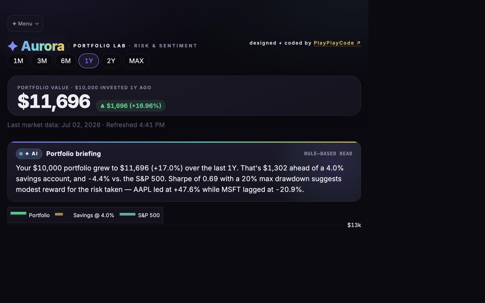
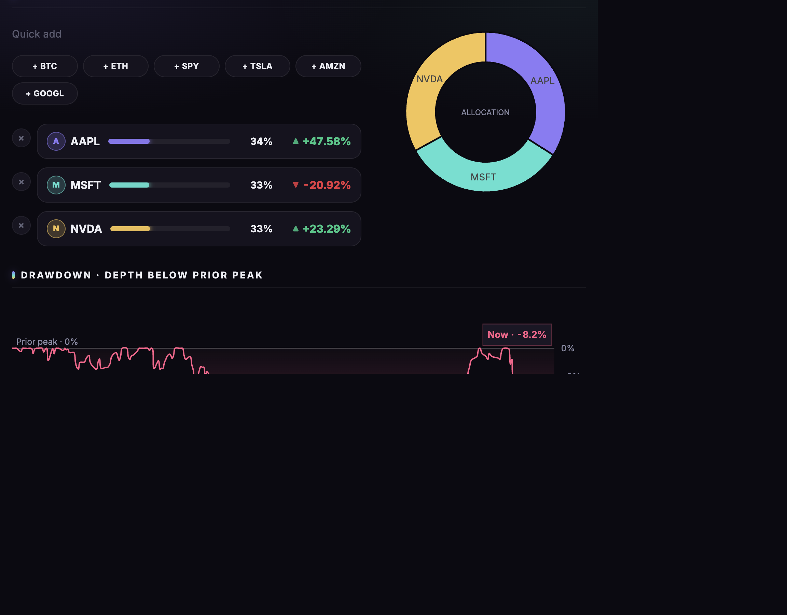

# Aurora Portfolio Lab

> A dark-mode Streamlit dashboard that pulls live market data, computes
> real risk metrics, and puts an **AI-authored portfolio briefing** at
> the top of the page. Built end-to-end as a design + engineering
> portfolio piece.

<p align="center">
  
</p>

<p align="center">
  <a href="https://aurora-portfolio-lab.streamlit.app/"></a>
  <a href="https://github.com/NORARAE/aurora-portfolio-lab/actions/workflows/ci.yml"></a>
  
  
  
  
</p>

**Live demo:** <https://aurora-portfolio-lab.streamlit.app/> ·
**Signature:** [PlayPlayCode](https://www.linkedin.com/in/ngenetti/)

---

## Why this exists

Most personal-portfolio dashboards give you a number and a chart and
call it a day. This one **reads its own numbers back to you in plain
English** — Sharpe of 0.69, 20% drawdown, AAPL leading at +47.6%, MSFT
lagging at −20.9%: the AI briefing at the top translates all of that
into three sentences a non-quant can actually act on.

Under the hood it's a straightforward Python codebase, cleanly split
across three files, with a real pytest suite and CI. It's built as a
portfolio piece — the point is showing craft in _both_ the math and
the presentation.

## Features

<table>
<tr>
<td width="50%">

**Live market data**

- Equities and crypto tickers via `yfinance`
- 6 preset baskets: AI leaders, FAANG+, Crypto majors, dividend blues, 60/40 balanced, S&P only
- Percent or dollar allocation, drag-to-rebalance sliders
- 1M → MAX range control

</td>
<td width="50%">

**Real risk math** (in [`finance_metrics.py`](finance_metrics.py))

- CAGR, Sharpe, Sortino, drawdown, recovery days
- Rolling volatility + rolling Sharpe
- SPY benchmark overlay + alpha vs. market
- Holdings correlation matrix

</td>
</tr>
<tr>
<td width="50%">

**AI briefing** (in [`sentiment.py`](sentiment.py))

- 3-sentence natural-language read of the portfolio
- Uses **Claude Sonnet** when `ANTHROPIC_API_KEY` is set
- Falls back to a rule-based template (never crashes)
- Cached per-portfolio with a 10-min TTL

</td>
<td width="50%">

**News sentiment (Aurora Oracle)**

- Headline sentiment via VADER (finance-tuned lexicon)
- Source-credibility weighting (Reuters, Bloomberg, WSJ…)
- Tap-to-filter tone tabs (Bullish / Bearish / Neutral)
- Optional Claude summary + timeline chart

</td>
</tr>
<tr>
<td width="50%">

**Shareable URLs**

- Every view encodes to a link (`?t=NVDA,BTC-USD&p=6M&i=25000`)
- Full round-trip: tickers, weights, range, investment
- One-click copy from the sidebar

</td>
<td width="50%">

**Polished UX**

- Aurora dark palette (violet + cyan + gold)
- Tactile `:active` click feedback on every card
- Keyboard-visible `:focus-visible` rings
- Full mobile responsive (2-column → 1-column)

</td>
</tr>
</table>

<p align="center">
  
</p>

## Architecture

Three files, one job each:

```
app.py               → Streamlit UI, layout, orchestration, all CSS.
                       Reads pandas from finance_metrics, calls sentiment.
                       ~2400 lines — most of it is the aurora design system.

finance_metrics.py   → Pure functions of pandas Series/DataFrame in,
                       numbers or Series out. No Streamlit imports.
                       Covered by pytest suite in tests/.

sentiment.py         → News fetching + sentiment scoring + AI briefing.
                       Claude-or-VADER degrades gracefully (missing API key
                       is the normal path, not an error).
```

If you're adding a feature, ask: is it _math_ (→ `finance_metrics`), _AI /
news_ (→ `sentiment`), or _presentation_ (→ `app`)? Put it in the right
file.

## Quick start

Requires Python 3.12 or 3.13 (`numpy 2.5` needs 3.12+).

```bash
git clone https://github.com/NORARAE/aurora-portfolio-lab.git
cd aurora-portfolio-lab
python -m venv .venv
source .venv/bin/activate            # Windows: .venv\Scripts\activate
pip install -r requirements.txt
streamlit run app.py
```

Then open <http://localhost:8501>.

### Optional: AI upgrades

Create `.streamlit/secrets.toml` (git-ignored):

```toml
# Enables the Claude-authored portfolio briefing + richer news summary.
ANTHROPIC_API_KEY = "sk-ant-..."

# Enables real stock logos on the holdings rows (falls back to gradient monograms).
QUIKTURN_KEY = "..."
```

Both are optional. Without either, the app still runs fully with a
rule-based briefing, VADER sentiment, and monogram badges.

## Running the tests

```bash
pip install -r requirements-dev.txt
pytest -v tests/                      # 37 tests, ~0.3s
ruff check .                          # lint
```

CI runs the same set on Python 3.12 and 3.13 on every push to `main`.

## Deploying to Streamlit Community Cloud

1. Push to a **public GitHub repo** (this one works).
2. Go to <https://streamlit.io/cloud> and sign in with GitHub.
3. Click **New app**, pick the repo + branch (`main`), and set the
   entrypoint to `app.py`. Python version: **3.13** (already pinned in
   `.python-version` — Streamlit Cloud auto-detects it).
4. (Optional) Under **Advanced settings → Secrets**, paste your
   `ANTHROPIC_API_KEY` and `QUIKTURN_KEY` in TOML format:
   ```toml
   ANTHROPIC_API_KEY = "sk-ant-..."
   QUIKTURN_KEY = "..."
   ```
5. Deploy. First cold start takes ~2 minutes; subsequent loads are
   near-instant.
6. Copy the deployed URL back into the **Live demo** line at the top
   of this README.

## Roadmap

- Sentiment-over-time cached daily (needs persistent storage)
- Efficient frontier: risk/return scatter of weight combinations
- Portfolio compare mode (two saved views side-by-side)
- PDF export of the current view

## Credits

- Design & engineering: [**PlayPlayCode**](https://www.linkedin.com/in/ngenetti/)
- Crypto icons: [Cryptocurrency Icons](https://github.com/spothq/cryptocurrency-icons)
  by spothq (CC0, public domain)

## Disclaimer

Educational and portfolio use only. **Not financial advice.** No warranty
of any kind. Market data can be delayed or wrong; the app degrades
gracefully but you should not trade on what you see here.
